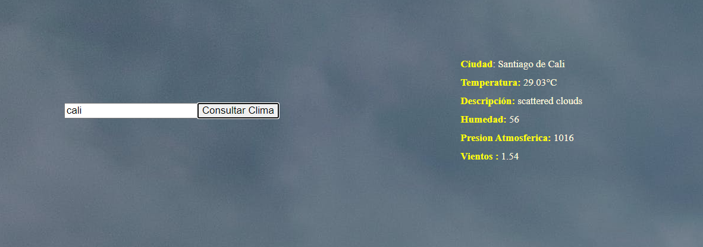

BIENVENIDO AL SISTEMA QUE TE PERMITE OBTENER EL CLIMA DE CUALQUIER PARTE DEL MUNDO

Ingresa el nombre de la ciudad o país que te interese y obtén al instante el estado del tiempo actual.

Visualiza información detallada, incluyendo temperatura, humedad, velocidad del viento y dirección.

 Diseño limpio y amigable para una experiencia de usuario sin complicaciones.

En la página principal, utiliza el campo de búsqueda para ingresar el nombre de la ciudad o país que desees consultar.

 
 Podras visualizar en la parte derecha de tu busqueda, los resultados del clima de la ciudad o pais.

TECNOLOGIAS UTILIZADAS
HTML5: Estructura de la página web.
CSS3: Estilos y diseño responsivo.
JAVASCRIPT: Interactividad y manipulación de datos.
API DE CLIMA: Conexión con una API de terceros para obtener datos precisos y actualizados.

Instalación Local
Clona este repositorio en tu máquina local.
Abre el archivo index.html en tu navegador web.
¡Listo! Ahora puedes explorar el clima de cualquier lugar del mundo desde la comodidad de tu navegador.

